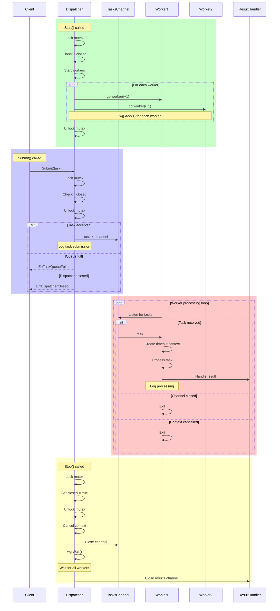

# Go Dispatcher

A concurrent task processing system that efficiently manages and executes tasks using a worker pool pattern.

## System Overview

The Go Dispatcher is a robust concurrent task processing system that implements a worker pool pattern with careful attention to thread safety and graceful shutdown. At its core, it manages a pool of worker goroutines that process tasks concurrently while maintaining proper synchronization and error handling.

The system revolves around a central `Dispatcher` struct that orchestrates task distribution, worker management, and result handling. Tasks are submitted through a buffered channel, which acts as a queue, allowing for controlled backpressure when the system is under heavy load. Each worker goroutine independently picks up tasks from this channel, processes them with a configurable timeout, and sends results through a flexible result handling mechanism.

Concurrency control is implemented through a combination of mutexes for state protection and WaitGroups for worker tracking. The system supports graceful shutdown through context cancellation, ensuring that in-flight tasks are completed before the system terminates. Error handling is comprehensive, covering queue full conditions, dispatcher closed states, task timeouts, and processing errors.

The architecture is designed to be both efficient and safe, with proper synchronization primitives at every step of the task lifecycle. It's also highly configurable, allowing users to specify the number of workers, queue size, and task timeout duration. Additionally, the system supports customization through interfaces for both task processing and result handling, making it adaptable to various use cases.

## Detailed Operation Flow
The following diagram shows the detailed interaction between components during the dispatcher's lifecycle:

## Contributing

1. Fork the repository
2. Create a feature branch
3. Make your changes
4. Run tests
5. Submit a pull request
